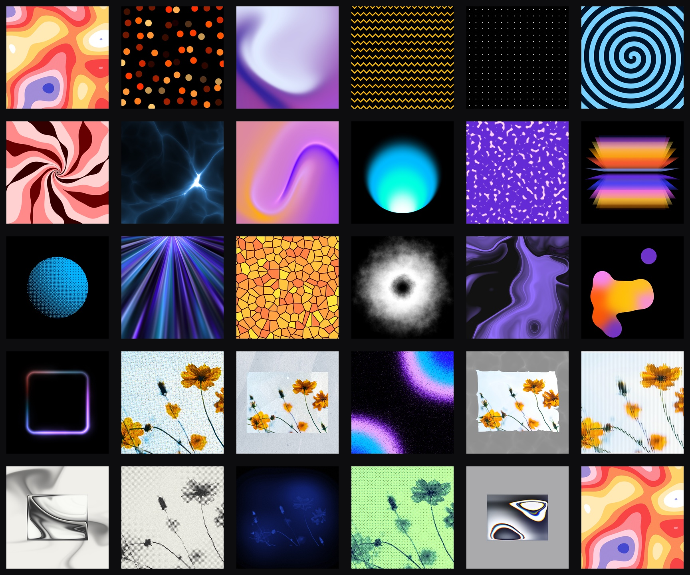

# PaperShaders (Swift/Metal)

Swift/Metal port of [Paper Shaders](https://github.com/paper-design/shaders) — zero-dependency animated shaders as SwiftUI views, backed by a MetalKit core.



**Status: Swift/Metal port complete** — core runtime (`ShaderMount`, GLSL→MSL helpers, shared vertex shader, offscreen PNG rendering), typed SwiftUI wrappers, a demo app, and all 29 upstream shaders validated against golden renders of the upstream WebGL implementation:

- `color-panels`
- `dithering`
- `dot-grid`
- `dot-orbit`
- `fluted-glass`
- `gem-smoke`
- `god-rays`
- `grain-gradient`
- `halftone-cmyk`
- `halftone-dots`
- `heatmap`
- `image-dithering`
- `liquid-metal`
- `mesh-gradient`
- `metaballs`
- `neuro-noise`
- `paper-texture`
- `perlin-noise`
- `pulsing-border`
- `simplex-noise`
- `smoke-ring`
- `spiral`
- `static-mesh-gradient`
- `static-radial-gradient`
- `swirl`
- `voronoi`
- `warp`
- `water`
- `waves`

## Targets

- `PaperShaders` — MetalKit core, iOS 15+ / macOS 12+.
- `PaperShadersSwiftUI` — one typed SwiftUI view per shader, plus the generic `ShaderView` for catalog-driven rendering.
- `Examples/PaperShadersDemo` — SwiftUI demo app (iOS 16+ / macOS 13+): every `ShaderCatalog` shader with a preset picker and animated full-screen rendering. Open `PaperShadersDemo.xcodeproj` to run on iOS Simulator, device or macOS (real app bundle), or `swift run` from `Examples/PaperShadersDemo` for a quick unbundled macOS run. CLI build: `xcodebuild -project PaperShadersDemo.xcodeproj -scheme PaperShadersDemo -destination 'generic/platform=iOS Simulator' build`.

## Installation

Add the package in Xcode with **File > Add Package Dependencies...** and the
GitHub URL of this repository, then link either:

- `PaperShadersSwiftUI` for SwiftUI apps;
- `PaperShaders` for the lower-level MetalKit runtime and offscreen renderer.

In `Package.swift`:

```swift
.package(url: "https://github.com/AndreFrelicot/paper-shaders-swift.git", from: "0.0.3")
```

```swift
.product(name: "PaperShadersSwiftUI", package: "paper-shaders-swift")
```

## Usage

Use the typed SwiftUI wrappers for direct rendering:

```swift
import PaperShadersSwiftUI
import SwiftUI

struct Background: View {
  var body: some View {
    SimplexNoiseView()
      .ignoresSafeArea()
  }
}
```

Pass typed params to customize a shader:

```swift
MeshGradientView(
  params: MeshGradient.Params(
    colors: ["#e0eaff", "#241d9a", "#f75092", "#9f50d3"],
    distortion: 0.8,
    swirl: 0.1,
    sizing: .defaultObject,
    speed: 1
  )
)
```

Render from the catalogue when you need a dynamic shader picker:

```swift
let entry = ShaderCatalog.all[0]
let preset = entry.presets[0]

ShaderView(
  descriptor: entry.descriptor,
  uniforms: preset.uniforms,
  sizing: preset.sizing,
  speed: preset.speed,
  frame: 0
)
```

Image shaders (`water`, `image-dithering`, …) draw a bundled sample photo by
default. Give them your own with `ShaderMountView(descriptor:…, image:)` or
`setImage(_:)` on `ShaderMountView` / `OffscreenRenderer`; `nil` brings the
sample back:

```swift
let view = try ShaderMountView(
  descriptor: Water.descriptor,
  uniforms: Water.Params().uniforms,
  sizing: Water.Params().sizing,
  image: photo.cgImage
)
```

Set `speed: 0` and pass a fixed `frame` for deterministic still renders and
golden tests. The demo app can also copy a Swift initialization snippet for the
current edited preset.

### Interactive render options

`ShaderView` accepts `ShaderRenderOptions` for on-screen rendering. The default
`.fixed` mode keeps the parity-oriented precise Metal math path. For live
previews, use `.interactive` or `.adaptive(...)` to allow fast Metal math and,
optionally, adaptive resolution:

```swift
ShaderView(
  descriptor: entry.descriptor,
  uniforms: preset.uniforms,
  sizing: preset.sizing,
  speed: preset.speed,
  renderOptions: .adaptive(targetFrameRate: 60)
)
```

Fast math is intended for interaction. Offscreen golden rendering remains on
the precise path by default.

## Parity testing

Reference goldens (512×512, `frame=41500`, `speed=0`, `pixelRatio=1`) and the perceptual comparator live in the companion workbench repo (`../paper-shaders-prd`):

```sh
Scripts/check-parity.sh   # render all ported presets offscreen and compare to goldens
```

Requires a Metal device (parity tests are skipped in environments without one, e.g. GitHub-hosted CI runners).

### Threshold

The comparator is upstream-style pixelmatch (YIQ per-pixel threshold 0.1) with a
maximum ratio of differing pixels of **`--fail-ratio 0.01`** (1%). All **120
presets of the 29 ported shaders pass** on the current Metal reference machine.
Most renders stay under the default threshold; the known backend-sensitive
exceptions are explicitly scoped in `Scripts/check-parity.sh` and documented in
`docs/DERIVATIVE-PARITY.md` and `docs/GOLDEN-PARITY.md`. Renders are
deterministic across runs on the same machine.

Two parity-sensitive details worth knowing:

- MSL is compiled with safe math and precise float functions
  (`MTLCompileOptions`): fast math contracts/reassociates float ops and uses
  approximate `sin`/`cos`, which decorrelates hash-based noise from the WebGL
  reference at high octave frequencies (`perlin-noise`).
- `fwidth`/screen-space derivative parity is backend-sensitive. Shaders that
  need a deterministic derivative path document that choice in
  [`docs/DERIVATIVE-PARITY.md`](docs/DERIVATIVE-PARITY.md).
- High-amplitude `fract(sin(dot()))` noise can be backend-sensitive. The
  current isolated case is documented in
  [`docs/GOLDEN-PARITY.md`](docs/GOLDEN-PARITY.md).
- Goldens are element screenshots of a transparent WebGL canvas over the white
  harness page, so the golden render path composites non-opaque output over
  white before comparing (`OffscreenRenderer.writePNG(_:to:background:)`).

## Release Checks

Before tagging a release:

```sh
swift test
Scripts/check-parity.sh
cd Examples/PaperShadersDemo
xcodebuild -project PaperShadersDemo.xcodeproj -scheme PaperShadersDemo -destination 'generic/platform=iOS Simulator' build
swift package archive-source
```

The release repository should keep only package, docs, tests, scripts, and demo
sources. Workbench-only agent instructions stay in the companion workbench repo.

## License

Apache 2.0 — see `LICENSE` and `NOTICE`. Derived from [paper-design/shaders](https://github.com/paper-design/shaders).
